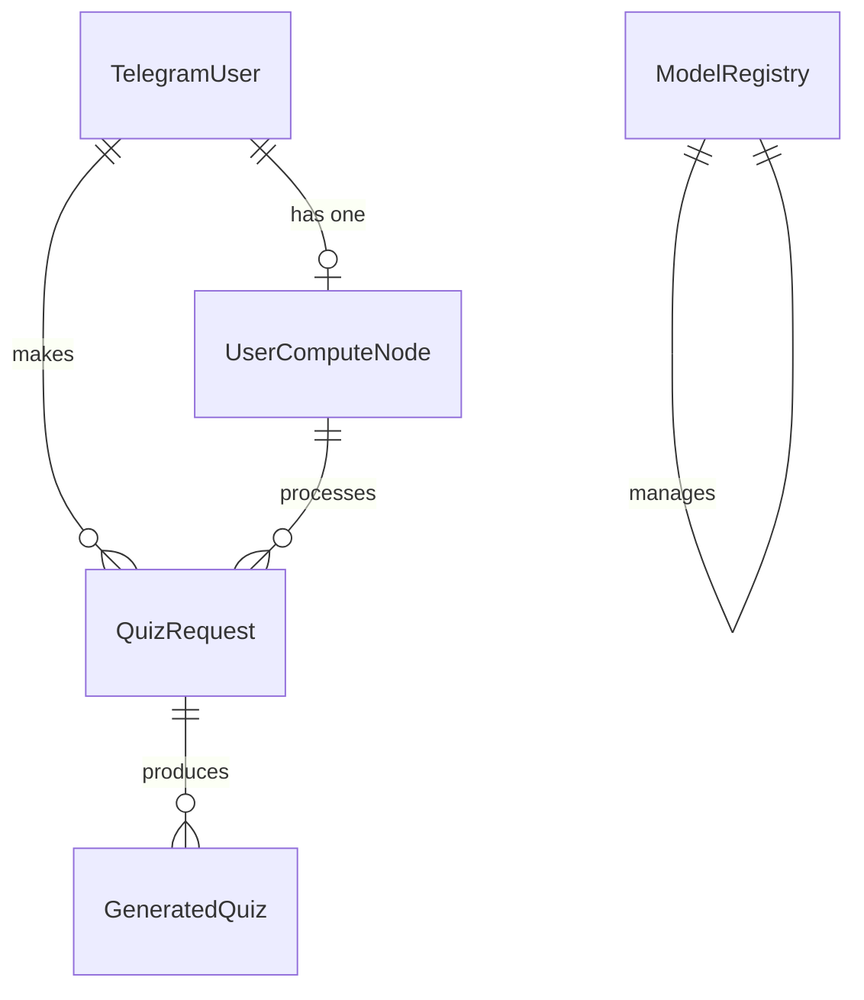

I will start by listing the directory structure of the Django project to identify the core components, modules, and structure of the application. Let's inspect the files in the workspace.

Listed directory Django

I will list the contents of the main directories to map the application layout and identify where the core logic is implemented.

Listed directory compute

I will check the files inside the `llm` folder.

Listed directory llm

I will check the configuration folder `quiz_backend` which typically holds settings, urls, and wsgi setup in Django.

Listed directory quiz_backend

I will check the `quizzes` application folder contents.

Listed directory quizzes

I will inspect the `users` application folder.

Listed directory users

I will check the `quizzes/management` folder to see if there are custom management commands.

Listed directory management

I will list the command files under management commands.

Listed directory commands

I will start by viewing `quiz_backend/settings.py` to examine settings, installed apps, database configuration, Celery configs, and external API variables.

Viewed settings.py:1-147

I will view `quiz_backend/celery.py` to confirm the Celery configuration.

Viewed celery.py:1-11

I will view `quiz_backend/urls.py` to trace the routing and entry points.

Viewed urls.py:1-25

I will read `users/models.py` to see the custom User model fields.

Viewed models.py:1-10

I will read `quizzes/models.py` to inspect the quiz-related data models.

Viewed models.py:1-42

I will view `compute/models.py` to see the structure of UserComputeNode.

Viewed models.py:1-14

I will view `compute/views.py` to understand how compute nodes register, check in, and process tasks.

Viewed views.py:1-93

I will view `compute/serializers.py` to understand the data serialization used for communication with compute nodes.

Viewed serializers.py:1-19

I will view `compute/urls.py` to check the URL routing for compute nodes.

Viewed urls.py:1-9

I will inspect `quizzes/urls.py` to see the routing for Telegram webhooks or user-facing quiz requests.

Viewed urls.py:1-7

I will view `quizzes/views.py` to examine the Telegram Webhook logic.

Viewed views.py:1-69

I will view `quizzes/tasks.py` to examine how Celery handles quiz processing via Central GPU, including how it interacts with the LLM.

Viewed tasks.py:1-146

I will view `llm/models.py` to check the data structure for registered language models.

Viewed models.py:1-17

I will view `llm/admin.py` to understand the admin configurations for models.

Viewed admin.py:1-37

I will view `local_quiz_bot.py` to understand the standalone bot polling script.

Viewed local_quiz_bot.py:1-231

I will view `quizzes/management/commands/telegram_polling.py` to see how polling is implemented as a Django command.

Viewed telegram_polling.py:1-48

I will view `quizzes/management/commands/set_webhook.py` to see how webhooks are configured programmatically.

Viewed set_webhook.py:1-37

I will view `Plan for django build.md` to see if there are additional details about the intended system architecture or requirements.

Viewed Plan%20for%20django%20build.md:1-178

I will read `Manual.md` to see if there are any specific guidelines or manuals for developers or users that we should capture.

Viewed Manual.md:1-24

I will read `docker-compose.yml` to check details of database and broker configurations.

Viewed docker-compose.yml:1-29

I will view `documentation_prompt.md` to verify if there are any other specific requests.

Viewed documentation_prompt.md:1-56

I will view `.env` to check the environment variable definitions (without revealing any real sensitive secrets if any).

Viewed .env

I will view `users/admin.py` to see how the custom `TelegramUser` is registered in the Django admin panel.

Viewed admin.py:1-11

### 1. Project Overview
The codebase implements a **Distributed Telegram AI Quiz Backend** designed to ingest raw user-submitted quiz and poll texts from Telegram, parse them into structured quiz formats using Large Language Models (LLMs), and publish the results back to Telegram channels or groups as native interactive poll messages. 

Crucially, the system moves beyond a centralized GPU computing bottleneck by implementing a **Distributed "Bring Your Own Compute" (BYOC) Framework**. When a registered Telegram user sends a quiz request, the system determines if they have a linked, active local compute node (running an agent that queries their local hardware, such as LM Studio or Ollama). If an active node check-in is detected, the task is marked for local processing and is retrieved via REST API polling, shifting resource-intensive LLM inference workloads entirely onto the user's local hardware. If no local compute node is active, the system automatically falls back to an asynchronous Celery task queue that processes requests using a central LLM server.

---

### 2. Tech Stack & Dependencies
- **Core Language**: Python (3.x)
- **Web & API Framework**: 
  - Django (v6.0.6)
  - Django REST Framework (DRF)
- **Database**: PostgreSQL (relational database for storing users, quiz tasks, generated items, and compute node heartbeats)
- **Asynchronous Task Queue & Broker**:
  - Celery (used for background model query jobs and rate-limited Telegram dispatching)
  - Redis (used as the Celery message broker and result backend)
- **API Clients & Networking**:
  - `httpx` (asynchronous and synchronous HTTP client for communicating with the local central LM Studio instance and the Telegram Bot API)
  - `requests` (used in polling tasks and command-line management commands)
- **Model Orchestration**:
  - Local LM Studio (OpenAI-compatible server running models like `google/gemma-4-e2b` at `http://localhost:1234`)
- **Containerization**:
  - Docker & Docker Compose (for orchestrating PostgreSQL and Redis service containers)

---

### 3. Architecture & Project Structure
#### Architectural Pattern
The application follows a **Model-View-Template (MVT)** / **Model-View-Controller (MVC)** architectural pattern extended by an asynchronous **Event-Driven Task Queue** (handled via Celery and Redis) and a **Client-Server Polling System** for distributed computing (BYOC).

#### Directory Structure
```
Django/
├── .env                       # Configures environment variables, including the Telegram Bot Token.
├── docker-compose.yml         # Defines Docker services for the PostgreSQL database and Redis message broker.
├── local_quiz_bot.py          # Standalone, direct Telegram bot polling script for local text-to-quiz conversion.
├── Manual.md                  # Quick-start run instructions for Docker, Django development server, Celery, and polling.
├── Plan for django build.md   # Architectural reference and requirements document for the distributed backend.
├── manage.py                  # Standard Django command-line utility for administrative tasks.
├── quiz_backend/              # Main Django project configuration folder.
│   ├── __init__.py            # Initializes the quiz_backend module and Celery app.
│   ├── asgi.py                # ASGI entrypoint for asynchronous web server deployments.
│   ├── celery.py              # Instantiates and configures the Celery background task environment.
│   ├── settings.py            # Main application configuration file holding database credentials, middleware, and app settings.
│   ├── urls.py                # Top-level URL routing mapping URLs to compute and quizzes applications.
│   └── wsgi.py                # WSGI entrypoint for web server deployments.
├── compute/                   # Application managing BYOC worker node registrations, heartbeats, and client polling.
│   ├── admin.py               # Registers compute models with the Django admin dashboard.
│   ├── apps.py                # Application configuration registry metadata.
│   ├── models.py              # Declares the UserComputeNode model tracking BYOC hardware instances.
│   ├── serializers.py         # Defines serializers for heartbeats, task data structure, and completions.
│   ├── urls.py                # Maps endpoints for worker heartbeat pinging and task fetching/completion.
│   └── views.py               # Implements views allowing nodes to check in, fetch pending tasks, and post results.
├── llm/                       # Application orchestrating central LLM server registry management.
│   ├── admin.py               # Registers model management screens and handles model synchronization hooks.
│   ├── apps.py                # Application configuration registry metadata.
│   ├── models.py              # Declares the ModelRegistry model containing models synced from LM Studio.
│   └── views.py               # Standard view file (unused placeholder).
├── quizzes/                   # Application managing quiz ingestion, parsing logic, and Telegram webhook interactions.
│   ├── admin.py               # Standard admin file (unused placeholder).
│   ├── apps.py                # Application configuration registry metadata.
│   ├── models.py              # Declares QuizRequest and GeneratedQuiz tracking schemas.
│   ├── tasks.py               # Contains Celery background tasks for central LLM query execution and Telegram posting.
│   ├── urls.py                # Maps the incoming Telegram update webhook endpoint.
│   ├── views.py               # Handles webhook message reception, user registration, and request dispatch routing.
│   └── management/            # Custom Django administrative commands folder.
│       └── commands/
│           ├── set_webhook.py      # Script to programmatically set the webhook URL with the Telegram Bot API.
│           └── telegram_polling.py # Local fallback polling CLI emulating Webhook requests.
└── users/                     # Application managing custom user configurations.
    ├── admin.py               # Configures the Django admin panel user view to include Telegram custom fields.
    ├── apps.py                # Application configuration registry metadata.
    └── models.py              # Declares the custom TelegramUser model extending AbstractUser.
```

---

### 4. Core Modules & Components

#### `compute` App
- **Purpose**: Tracks user-owned remote hardware compute nodes, monitors node connectivity via check-in heartbeats, and manages task polling/retrieval for local quiz extraction.
- **Key Classes/Functions**:
  - [UserComputeNode](file:///d:/Programming/Shater%20Bot/Django/compute/models.py#L5): Model holding node details including the unique authentication `api_key`, `last_heartbeat` timestamp, and `total_processed_tasks` count.
  - [HeartbeatView](file:///d:/Programming/Shater%20Bot/Django/compute/views.py#L18): API endpoint accepting check-in pings from running client agents to update node connection status.
  - [TaskPollView](file:///d:/Programming/Shater%20Bot/Django/compute/views.py#L30): API endpoint allowing active worker agents to fetch pending tasks designated for their respective owners.
  - [TaskCompleteView](file:///d:/Programming/Shater%20Bot/Django/compute/views.py#L54): API endpoint accepting parsed quiz results from client workers, saving the questions to the database, and updating request statuses.

#### `llm` App
- **Purpose**: Handles registry records for models accessible on the central LLM engine and manages model selection.
- **Key Classes/Functions**:
  - [ModelRegistry](file:///d:/Programming/Shater%20Bot/Django/llm/models.py#L3): Holds metadata of loaded LLMs. Overrides the `save` method to enforce that only a single model acts as the default fallback system-wide.
  - [ModelRegistryAdmin](file:///d:/Programming/Shater%20Bot/Django/llm/admin.py#L7): Implements a custom Django Admin action `sync_with_lm_studio` which calls the LM Studio model registry API (`/v1/models`) to automatically discover and record model names.

#### `quizzes` App
- **Purpose**: Manages the ingestion of incoming text messages, processes text blocks into structured quiz question units, and handles outbound Telegram poll broadcasts.
- **Key Classes/Functions**:
  - [QuizRequest](file:///d:/Programming/Shater%20Bot/Django/quizzes/models.py#L5): Tracks incoming texts, current parsing statuses, and assignments to compute nodes.
  - [GeneratedQuiz](file:///d:/Programming/Shater%20Bot/Django/quizzes/models.py#L32): Holds parsed question texts, JSON choice options, correct 0-indexed answer IDs, and textual rationales.
  - [TelegramWebhookView](file:///d:/Programming/Shater%20Bot/Django/quizzes/views.py#L15): Entry webhook validating messages, looking up active user BYOC nodes, and routing requests accordingly.
  - [process_quiz_central](file:///d:/Programming/Shater%20Bot/Django/quizzes/tasks.py#L32): Celery task utilizing central LLM resources to convert text chunks to JSON arrays. Implements a retry-on-failure structure.
  - [dispatch_quiz_to_telegram](file:///d:/Programming/Shater%20Bot/Django/quizzes/tasks.py#L107): Rate-limited Celery task (`rate_limit='20/m'`) dispatching native polls via the Telegram Bot API.

#### `users` App
- **Purpose**: Overrides standard user profiles to handle Telegram user profiles.
- **Key Classes/Functions**:
  - [TelegramUser](file:///d:/Programming/Shater%20Bot/Django/users/models.py#L4): Overridden model incorporating `telegram_id` and `is_premium` status flags.

#### Standalone `local_quiz_bot.py`
- **Purpose**: Operates as a direct client script executing a polling loop via Telegram's `getUpdates` API. Directly talks to a local LM Studio instance to convert input text and upload polls, functioning without DB persistence or Celery queues.
- **Key Classes/Functions**:
  - [start_bot_polling](file:///d:/Programming/Shater%20Bot/Django/local_quiz_bot.py#L205): Loop fetching Telegram updates.
  - [handle_incoming_message](file:///d:/Programming/Shater%20Bot/Django/local_quiz_bot.py#L134): Splits input text, invokes LLM generation, and handles output dispatch (including image attachments).

---

### 5. Data Models
The system relies on five primary database tables with distinct relationships:



1. **`users.TelegramUser`** (Inherits from `AbstractUser`)
   - `telegram_id` (*BigIntegerField*, unique, nullable): The user's Telegram profile identifier.
   - `is_premium` (*BooleanField*, default `False`): Grants permission to access the centralized GPU compute queue.
2. **`compute.UserComputeNode`**
   - `user` (*OneToOneField* to `TelegramUser`): Relates a specific Telegram user to their unique local hardware worker node.
   - `api_key` (*UUIDField*, default `uuid4`, unique): Authentication key for worker agents.
   - `last_heartbeat` (*DateTimeField*, nullable): Tracks client online status. If updated within 5 minutes, the node is considered active.
   - `total_processed_tasks` (*IntegerField*, default `0`): Tracks the amount of compute work offloaded.
   - `is_active` (*BooleanField*, default `True`): Toggles node active status.
3. **`quizzes.QuizRequest`**
   - `user` (*ForeignKey* to `TelegramUser`): The user who submitted the text request.
   - `raw_text` (*TextField*): The unparsed quiz text input.
   - `status` (*CharField*, choices: `PENDING`, `WAITING_FOR_NODE`, `DISPATCHED_TO_NODE`, `COMPLETED`, `FAILED`): Tracks parsing lifecycle.
   - `processed_by_type` (*CharField*, choices: `CENTRAL_GPU`, `USER_NODE`, `UNASSIGNED`): Tracks how the task was computed.
   - `processed_by_node` (*ForeignKey* to `UserComputeNode`, nullable): Identifies the specific node that computed the results.
   - `chat_id` (*CharField*, nullable): Tracks the chat destination for returning results.
4. **`quizzes.GeneratedQuiz`**
   - `request` (*ForeignKey* to `QuizRequest`): The ingestion source model.
   - `question` (*TextField*): The parsed question string.
   - `options` (*JSONField*): An array of strings representing options.
   - `correct_option_id` (*IntegerField*): The 0-indexed correct option identifier.
   - `explanation` (*TextField*, nullable): The explanation text for the correct answer.
5. **`llm.ModelRegistry`**
   - `model_identifier` (*CharField*, unique): The specific model identifier string (e.g. `google/gemma-4-e2b`).
   - `is_downloaded` (*BooleanField*, default `False`): Download status of the model on the central server.
   - `file_size` (*CharField*, nullable): Metadata showing file size.
   - `is_active_default` (*BooleanField*, default `False`): Sets this model as the active fallback engine.

---

### 6. API / Interfaces

#### 1. Telegram Ingestion Webhook
- **URL**: `/api/v1/telegram/webhook/`
- **Method**: `POST`
- **Purpose**: Receives message updates from the Telegram Bot API.
- **Expected Inputs**:
  ```json
  {
    "update_id": 123456789,
    "message": {
      "message_id": 987,
      "chat": { "id": -5146663020 },
      "from": { "id": 11223344, "username": "quiz_user" },
      "text": "Question 1\nWhat is Python?\nA) Snake\nB) Language\nCorrect: B"
    }
  }
  ```
- **Expected Outputs**:
  - `{"status": "ok"}` (HTTP 200) - Ingestion and routing successful.
  - `{"status": "ignored"}` (HTTP 200) - Received text lacks keywords `"A)"` or `"Question"`.

#### 2. Worker Heartbeat Check-In
- **URL**: `/api/v1/worker/heartbeat/`
- **Method**: `POST`
- **Purpose**: Invoked by client agents to report active availability.
- **Expected Inputs**:
  ```json
  { "api_key": "9cf76008-8f85-48fa-aaee-613d7d74f884" }
  ```
- **Expected Outputs**:
  - `{"status": "ok"}` (HTTP 200) - Heartbeat updated.
  - `{"error": "Invalid API Key"}` (HTTP 401) - Inactive or non-existent key.

#### 3. Worker Task Poll
- **URL**: `/api/v1/worker/tasks/`
- **Method**: `GET`
- **Purpose**: Checks for pending tasks assigned to the polling node.
- **Headers / Query Params**: Expects `X-API-Key` in HTTP headers or `api_key` in request query parameters.
- **Expected Outputs**:
  - `{"id": 42, "raw_text": "Question 1\nWhich language..."}` (HTTP 200) - Returns details and updates status to `DISPATCHED_TO_NODE`.
  - `{"message": "No pending tasks"}` (HTTP 204) - No matching task waiting.
  - `{"error": "Invalid API Key"}` (HTTP 401) - Missing or invalid credentials.

#### 4. Worker Task Completion
- **URL**: `/api/v1/worker/tasks/<int:task_id>/complete/`
- **Method**: `POST`
- **Purpose**: Accepts parsed quiz results from local compute nodes.
- **Expected Inputs**:
  ```json
  {
    "api_key": "9cf76008-8f85-48fa-aaee-613d7d74f884",
    "results": [
      {
        "question": "What is Python?",
        "options": ["Snake", "Language"],
        "correct_option_id": 1,
        "explanation": "Python is a programming language."
      }
    ]
  }
  ```
- **Expected Outputs**:
  - `{"status": "Task marked completed"}` (HTTP 200) - Result successfully generated and saved.
  - `{"error": "Task not found or not assigned to this node"}` (HTTP 404) - Invalid task reference.

---

### 7. Setup & Installation
Follow these steps to set up and run the Django project locally:

1. **Verify Prerequisites**:
   Ensure you have Python 3.10+, Docker, and Docker Compose installed.

2. **Configure Environment Variables**:
   Create a `.env` file in the project root containing your configurations:
   ```env
   TELEGRAM_BOT_TOKEN="your_telegram_bot_token"
   DB_NAME="quiz_db"
   DB_USER="quiz_user"
   DB_PASSWORD="quiz_password"
   DB_HOST="localhost"
   DB_PORT="5432"
   CELERY_BROKER_URL="redis://localhost:6379/0"
   CELERY_RESULT_BACKEND="redis://localhost:6379/0"
   ```

3. **Launch Infrastructure Containers**:
   Start PostgreSQL and Redis by executing:
   ```bash
   docker compose up -d
   ```

4. **Initialize Virtual Environment**:
   ```bash
   python -m venv venv
   .\venv\Scripts\activate   # On Windows
   # source venv/bin/activate # On macOS/Linux
   pip install -r requirements.txt
   ```
   *(Ensure `django`, `djangorestframework`, `psycopg2-binary`, `httpx`, `celery`, `redis`, and `python-dotenv` are installed).*

5. **Run Migrations & Create User**:
   ```bash
   python manage.py migrate
   python manage.py createsuperuser
   ```

6. **Start Background Processing (Celery)**:
   In a separate terminal with your virtual environment active, start the Celery worker:
   ```bash
   celery -A quiz_backend worker -l INFO --pool=solo
   ```

7. **Launch the Django Application Server**:
   ```bash
   python manage.py runserver
   ```

8. **Start Telegram Message Ingestion**:
   - For production environments, set up the webhook:
     ```bash
     python manage.py set_webhook https://<your-domain>/api/v1/telegram/webhook/
     ```
   - For local development without public HTTPS URLs, run the polling fallback command:
     ```bash
     python manage.py telegram_polling
     ```

---

### 8. CV / Resume Highlights (Fullstack AI Engineer Focus)

#### Core AI Engineering
- **OpenAI-Compatible Model Integrations**: Integrated Python client libraries (`httpx`, `requests`) with OpenAI-compatible APIs (LM Studio) to perform text conversions utilizing local models (e.g., `google/gemma-4-e2b`).
- **Structured JSON Prompt Engineering**: Devised detailed system prompting instructions that restrict LLM completions to strict JSON schema definitions (representing arrays of parsed questions, cleaned choices, correct option indices, and explanations), avoiding conversational text and markdown blocks.
- **Dynamic Model Registries**: Implemented a model registry database model inside Django to coordinate active LLMs dynamically, including a Django Admin interface trigger that polls active models from LM Studio using REST endpoints to automatically populate the database registry.

#### Key Technical Challenges Solved
- **BYOC Distributed Task Routing**: Engineered a "Bring Your Own Compute" (BYOC) infrastructure mapping task ingestion to remote compute nodes. Using a heartbeat system, incoming workloads are dynamically routed to user-owned local hardware, which retrieves text blocks via polling and submits completed JSON objects via REST endpoints, mitigating server-side inference costs.
- **Asynchronous Task Management**: Orchestrated backend workflows using Celery and Redis to run LLM parsing routines in the background. Included failure retries with custom countdowns and task status progression mapping (`PENDING` -> `DISPATCHED_TO_NODE` -> `COMPLETED`/`FAILED`).
- **Webhook View Emulation via Polling**: Developed a custom Django CLI management command (`telegram_polling`) that uses Django REST Framework's `APIRequestFactory` to ingest messages via Telegram's updates API and route them through the webhook pipeline, facilitating local debugging without relying on production HTTPS webhooks.

#### Performance & Scalability
- **Decoupled Architecture**: Utilized Celery to separate user-facing webhook ingestion from slow, blocking LLM inference, ensuring quick `200 OK` responses back to Telegram.
- **API Rate-Limiting**: Configured explicit outbound task rate-limiting (`rate_limit='20/m'`) on Telegram message dispatching workers to align with Telegram Bot API constraints and mitigate HTTP 429 rate-limiting blocks.

#### Resume Bullet Points
- **Engineered** a distributed "Bring Your Own Compute" (BYOC) routing architecture using Django and REST API endpoints, allowing registered clients to poll and execute resource-intensive LLM inference workloads on their own local hardware, reducing cloud server compute costs.
- **Architected** an asynchronous, fault-tolerant quiz parsing pipeline using Celery and Redis, utilizing structured prompt engineering on OpenAI-compatible APIs to transform unstructured inputs into validated JSON models with automated retry queues.
- **Designed** a flexible ingestion pipeline supporting both webhooks and local polling loops by utilizing Django REST Framework's `APIRequestFactory` to mock web requests, ensuring high-throughput ingestion and smooth debugging.
- **Integrated** a dynamic Model Registry system in Django, implementing admin hooks to query and register available LLMs from local servers at runtime while ensuring strict system-wide default model integrity.

---

### Summary of Work Done
- Conducted codebase analysis across all Django apps: `compute`, `llm`, `quizzes`, `users`, and `quiz_backend` configuration files.
- Analyzed the standalone script `local_quiz_bot.py` and Django custom management commands.
- Mapped all data models, their schemas, fields, and relationships.
- Traced API endpoints, webhook payloads, and worker interfaces.
- Structured the technical documentation exactly as requested, providing a setup guide and specialized CV highlights for a Fullstack AI Engineer without fabricating details or assuming frontend features.